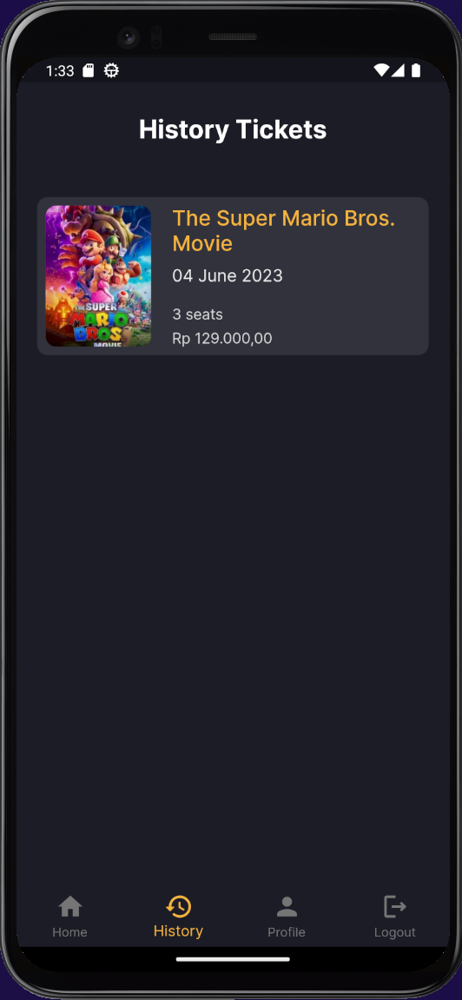
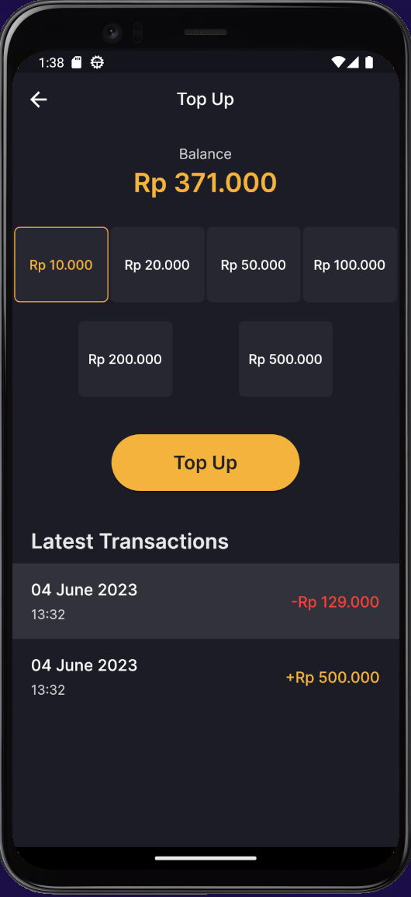

# Movie App Flutter

Movie App is a mobile application for booking movie tickets. Built using Flutter.

## Techologies and Libraries

- Flutter
- Dart
- Dio
- Cloud storage
- Firebase
- Firestore
- BloC
- Go Router
- intl
- Equatable
- Freezed

## Screenshot

| Login                                     | Home                                     |
| ----------------------------------------- | ---------------------------------------- |
|  |  |

| Movie Detail                                     | Seats                                     |
| ------------------------------------------------ | ----------------------------------------- |
|  |  |

| History                                     | Ticket Detail                                     |
| ------------------------------------------- | ------------------------------------------------- |
|  |  |

| Profile                                     | Edit Profile                                     | Topup                                     |
| ------------------------------------------- | ------------------------------------------------ | ----------------------------------------- |
|  |  |  |

## Installation

Use flutter to run the app

```bash
flutter get
flutter run
```
